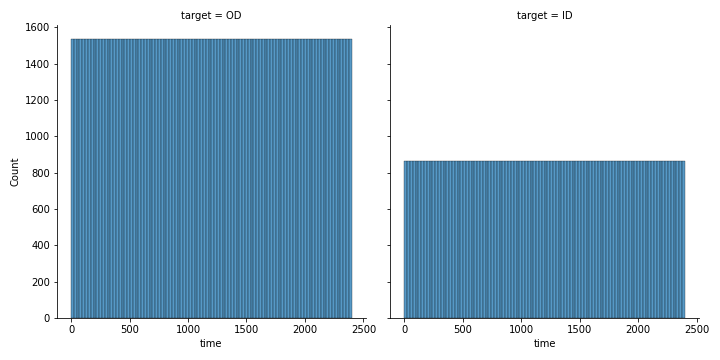
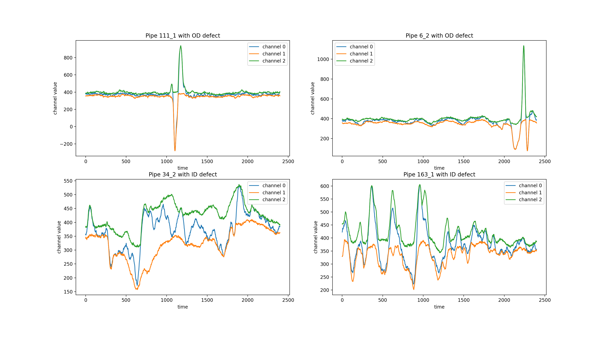
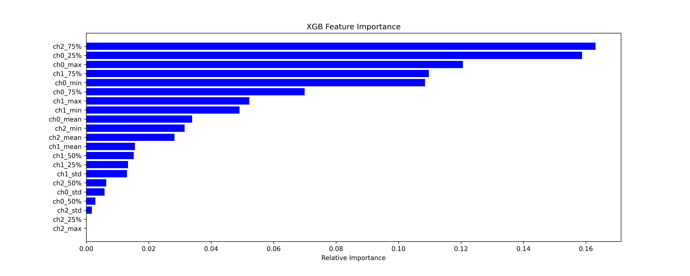
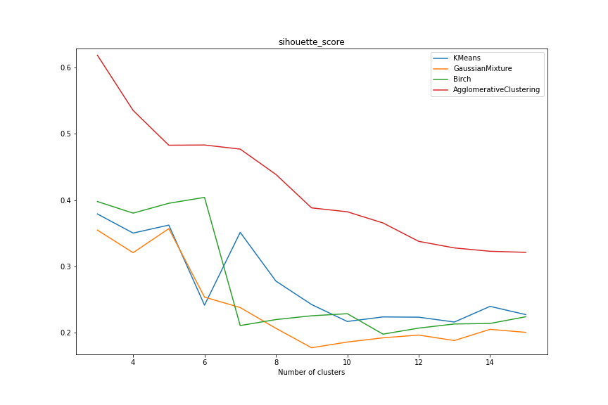
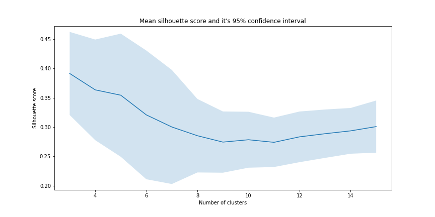
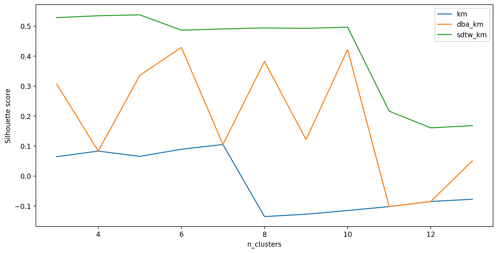
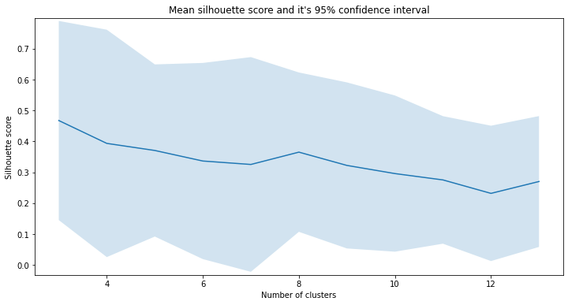

# Introduction 
This repository contains test task for Data Scientists

# Task description

We had several measurements (MFL) of the pipe defects.

Each measurement has 3 channels.

Each measurement (defect) belongs to one of two defect location ( internal and external , or ID and OD).
Also, each defect belongs to different sub-type (i.e, corrosion, dent, gouge, etc.)

Candidate should:

1. Perform EDA. Draw conclusions.

2. On the basis of provided data, train classifier that will predict defect location for unlabeled data.
Scoring - F1 

Goal is to get F1 >0.8

3. Perform unsupervised clustering. 
Identify optimal number of clusters.
Draw most typical representative of each identified class.


# EDA

According to data explorating, we can see that all observered samples have the same number of time point. Distribution od the time is unit and range by 0 to 2399.



But we can see the frequency in 2 times smaller for one of classes, that means our dataset is imbalanced.

If we see the example of our observation, we can see that for 3 channels in time the sequence for OD is pretty different than for ID.



There is a hypothesis that we can try to use classical machine learning approach and try to extract some fetures for use classical ML algorithm.

# Classification

## Classical machine learning approach.

I tried to use the follows features *for each channel*:

- min, max value;
- mean, std;
- 25, 50 and 75% percentiles.

And we can use as base algorithms:

- simple linear regression;
- nKNN classifier;
- baggind - Random Forest;
- busting - XGBoost.

Result tables for this approach:

| Algorithm           | Train Accuracy | Test Accuracy | Train F1-score | Test F1-score |
|---------------------|----------------|---------------|----------------|---------------|
| Logistic Regression | 0.925          | 1.0           | 0.924          | 1.0           |
| kNN (3 neighbors)   | 0.9            | 0.95          | 0.896          | 0.950         |
| Random Forest       | 1.0            | 1.0           | 1.0            | 1.0           |
| XGBoost             | 1.0            | 1.0           | 1.0            | 1.0           |

There is XGBoost feature importance calculation



## Time-series classification

Also we can use raw unfeatured data as input for deep learning approach. But there is specific library (called ```tslearn```) with specific classical ML algorithms, adapted to time-series input.

```KNeighborsTimeSeriesClassifier``` with 2 neighbors give us 0.85 F1-score on a train set and 0.832 on a test set.

# Clastering

## Classical ML clustering

For optimal number of classes we can use two simple technologies

Using the features engineering -- classic approach



Using resampling technology



If we use time-series kmeans (```TimeSeriesKMeans```)




Using resampling technology

